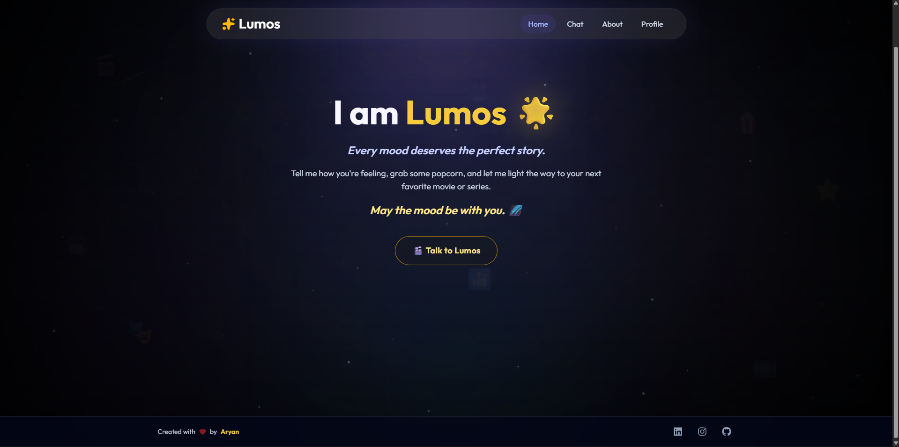
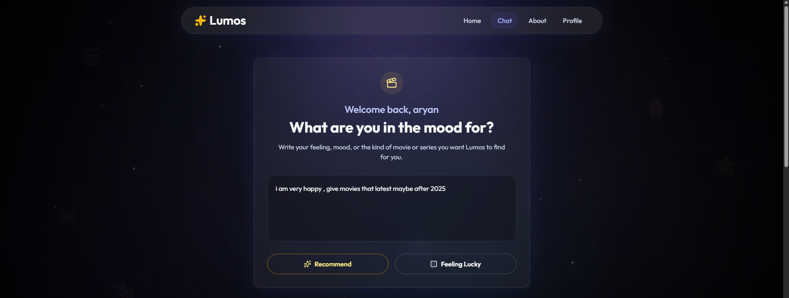
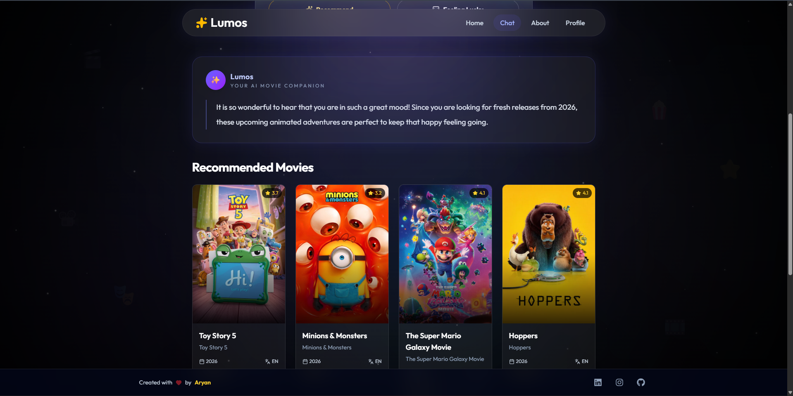

# 🎬 Lumos – AI Movie & TV Recommendation Platform

Lumos is an AI-powered movie and TV recommendation platform that understands natural language conversations and suggests personalized content based on the user's mood, preferences, genres, and more.

The project consists of:

- **Frontend:** React + Vite + Tailwind CSS
- **Backend:** FastAPI + Google Gemini AI + TMDB API

---

# ✨ Features

- 🤖 AI-powered conversational recommendations
- 🎭 Mood-based movie & TV suggestions
- 🔍 Search by genre, language, year, etc.
- 🎲 "Feeling Lucky" recommendation prompts
- 🎬 Rich movie cards with posters, ratings, release dates, and language
- 💬 Natural chat interface
- 📱 Responsive UI
- ⚡ FastAPI backend with Gemini integration
- 🎥 TMDB integration for movie metadata

---

# 📂 Project Structure

```text
Lumos/
│
├── frontend/
│   ├── src/
│   ├── public/
│   └── ...
│
├── backend/
│   ├── app.py
│   ├── prompts/
│   ├── services/
│   ├── requirements.txt
│   └── ...
│
└── README.md
```

---

# 🖥 Frontend

## Tech Stack

- React
- Vite
- Tailwind CSS
- React Router
- Framer Motion
- Lucide React
- React Icons

## Installation

```bash
cd frontend
npm install
```

## Run Development Server

```bash
npm run dev
```

## Build for Production

```bash
npm run build
```

---

# ⚙ Backend

## Tech Stack

- FastAPI
- Google Gemini API
- TMDB API
- MongoDB
- Python
- Uvicorn
- Pydantic

## Installation

```bash
cd backend

python -m venv venv
```

Activate the virtual environment.

### Windows

```bash
venv\Scripts\activate
```

### Linux / macOS

```bash
source venv/bin/activate
```

Install dependencies:

```bash
pip install -r requirements.txt
```

---

## Environment Variables

Create a `.env` file inside the `backend` directory.

```env
APP_NAME=Lumos
APP_VERSION=1.0.0
APP_DESCRIPTION=Backend API for Lumos (AI Movie Mood Companion)

DEBUG=True

MONGODB_URI=your_mongodb_connection_string
DATABASE_NAME=lumos

GEMINI_API_KEY=your_gemini_api_key
TMDB_BEARER_TOKEN=your_tmdb_bearer_token
```

> **Note:** Never commit your `.env` file or API keys to GitHub. Add `.env` to your `.gitignore`.

---

## Run Backend

```bash
uvicorn app:app --reload
```

The backend will start on:

```text
http://localhost:8000
```

---

# 🚀 Deployment

## Frontend

Deploy using:

- Vercel
- Netlify

## Backend

Deploy using:

- Render
- Railway
- VPS

---

# 🛠 API Workflow

```text
User
   │
   ▼
React Frontend
   │
   ▼
FastAPI Backend
   │
   ▼
Gemini AI
   │
   ▼
Structured Recommendation
   │
   ▼
TMDB API
   │
   ▼
Movie Details
   │
   ▼
Frontend UI
```

---

# 📸 Screenshots

## 🏠 Home



---

## 💬 Chat



---

## 🎬 Recommendations



---

# 📦 Scripts

## Frontend

```bash
npm run dev
npm run build
npm run preview
```

## Backend

```bash
uvicorn app:app --reload
```

---

# 👨‍💻 Author

**Aryan Srivastava**

GitHub: https://github.com/AryanSrivastava1709

LinkedIn: https://www.linkedin.com/in/aryan-srivastava-17ar09/
